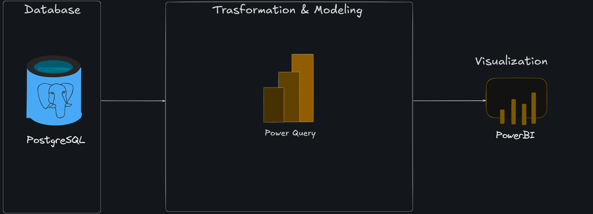

# Insurance Data Analysis

## Projects Overview

Proyek ini merupakan end-to-end data analysis pipeline yang mengekstraksi data asuransi dari database lokal, melakukan pembersihan dan transformasi data, hingga menghasilkan dasbor interaktif. Tujuannya adalah untuk memberikan visibilitas terhadap demografi nasabah, kinerja produk asuransi, dan status penyelesaian klaim guna mendukung keputusan bisnis yang lebih baik.

## Business Objective

Dalam industri asuransi, memantau rasio klaim terhadap premi dan memahami profil nasabah adalah hal yang krusial. Dasbor ini dirancang untuk menjawab pertanyaan bisnis berikut:

- Bagaimana distribusi status polis nasabah (Aktif vs. Tidak Aktif)?
- Produk asuransi mana yang menghasilkan pendapatan premi tertinggi?
- Bagaimana demografi umur memengaruhi besaran klaim yang diajukan?
- Bagaimana performa penyelesaian klaim (Ditolak, Disetujui, atau Tertunda)?

## Tech Stack

- Sumber Data: PostgreSQL (Local Database)
- Transformasi & Pemodelan: Power Query
- Visualisasi & Analisis: Power BI

## System Architecture

Data mentah dari PostgreSQL diimpor ke Power BI dan diproses menggunakan Power Query untuk memastikan data siap dianalisis. Beberapa tahap transformasi yang dilakukan meliputi:

- Changes Data Type: Mengubah format tipe data pada kolom policystartdate dan policyenddate dari teks (string) menjadi format date yang valid untuk memungkinkan analisis deret waktu.
- Add New Column:
  - Age Group Column: Menggunakan Conditional Column untuk membuat kategori Age Group untuk mempermudah analisis profil risiko:
    - <= 24 tahun diklasifikasikan sebagai Young Adult.
    - <= 60 tahun diklasifikasikan sebagai Adult.
    - .> 60 tahun diklasifikasikan sebagai Elder.
  - Active/Inactive Column: Membuat Conditional Column untuk melacak status Active/Inactive berdasarkan masa berlaku polis. Jika PolicyEndDate jatuh pada atau sebelum tanggal 10/12/2024, maka statusnya Inactive, selain dari itu dianggap Active.

## Key Insights

Berdasarkan dasbor yang telah dikembangkan, berikut temuan utama dari data asuransi:

- Tinjauan Finansial (KPI Utama): Perusahaan mencatat total Premium Amount sebesar 5.98M, dengan Claim Amount mencapai 16.91M, dan total nilai pertanggungan (Coverage Amount) di angka 600.55M.
- Kinerja Produk (Premi): Asuransi Perjalanan (Travel) adalah penyumbang premi terbesar (2.48M), jauh mengungguli produk lain seperti asuransi Kesehatan (Health - 1.20M) dan Kendaraan (Auto - 0.96M).
- Profil Demografi & Klaim: Kelompok usia Adult menyumbang nominal klaim tertinggi (8.8M), diikuti oleh kelompok Elder (6.4M). Secara gender, basis pelanggan terdistribusi sangat seimbang (5.001K Perempuan vs 5.003K Laki-laki).
- Status Klaim & Polis: Mayoritas polis saat ini berstatus aktif (5.82K). Namun, perlu diperhatikan bahwa tingkat penolakan klaim cukup tinggi (4.4K Rejected), yang mengindikasikan perlunya evaluasi pada proses pengajuan klaim nasabah.
